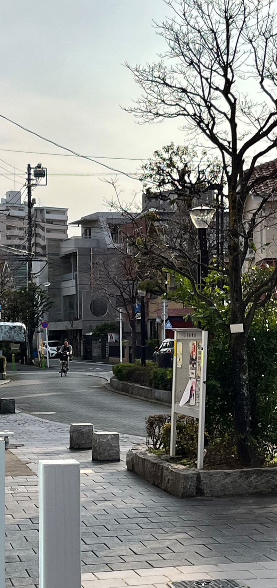
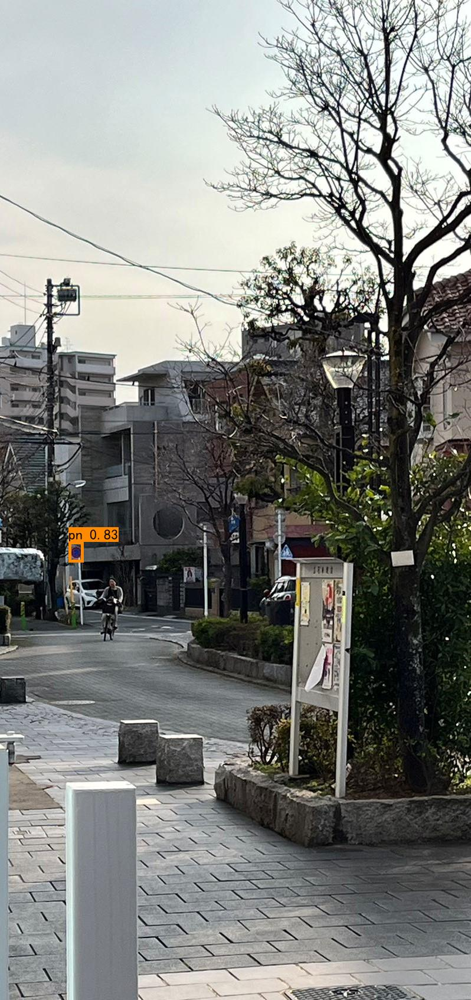

# Traffic_sign_Recognition_YOLOv4
This program deploys YOLOv4 to detect traffic signs. The application can be used for driving assistance, image detection.

## introduction
This program fine-tunes YOLOv4 with tt100k datasets.

## image processing results

Before detection:  

 

After detection: 

 

